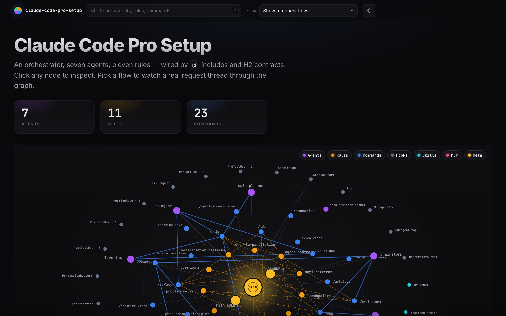

<p align="center">
  
</p>

# Claude Code Pro Setup

> One command to turn Claude Code into a production-grade AI engineering environment.

Custom agents, skills, commands, MCP servers, auto-formatting hooks, agentic RAG, and workflow automation — all preconfigured and ready to go.

---

## Interactive Architecture

See how the pieces fit together: 7 agents, 11 shared rules, 13 commands, 8 skills, hooks, MCP servers — plus animated request flows (`/autopilot`, `/bug`, `/qa-loop`, `/redesign`, `/brainstorm`, `/plan` and more).

**→ [Open the interactive visualization](https://zalogarcia.github.io/zalo-claude-code-setup/visualization/)**

<p align="center">
  <a href="https://zalogarcia.github.io/zalo-claude-code-setup/visualization/">
    
  </a>
</p>

Click any node to inspect its contract (completion markers, `@`-includes, dispatches). Pick a flow from the dropdown to watch a request travel through the system. Works on mobile with a vertical storyboard mode.

---

## Recommended Workflow

This is how I use Claude Code to get the best results on any task:

```
Plan + Research  -->  Optimize Plan  -->  Execute in Phases  -->  Verify + Test  -->  Repeat
```

1. **Plan + Research** — Before touching code, have Claude research the problem and produce a written plan (`safe-planner` agent or `/plan`). Understand the blast radius.
2. **Optimize the plan** — Review the plan, ask questions, refine. Get alignment before execution.
3. **Execute in phases** — Break the work into small, shippable phases. Implement one phase at a time.
4. **Verify + test after each phase** — Run builds, tests, and visual checks (`live-test` agent) after every phase. Never stack unverified changes.
5. **Continue implementing** — Move to the next phase only after the current one passes.
6. **Run QA multiple times** — Use the `qa-agent` repeatedly until all bugs are fixed. Don't ship until it passes clean.

This loop ensures nothing slips through. Plan first, execute small, verify always.

---

## Quick Install

### Prerequisites

Make sure these are installed first:

| Tool              | Install Command                                          | Purpose                                           |
| ----------------- | -------------------------------------------------------- | ------------------------------------------------- |
| **Node.js + npm** | [nodejs.org](https://nodejs.org/) or `brew install node` | Required for MCP servers and npx                  |
| **Python 3**      | `brew install python3`                                   | Required for UI/UX Pro Max skill search engine    |
| **jq**            | `brew install jq`                                        | Required for hook JSON parsing                    |
| **Prettier**      | `npm install -g prettier`                                | Auto-formats TS/JS/CSS/JSON/MD/HTML on every edit |
| **Ruff**          | `pip install ruff`                                       | Auto-formats and lints Python on every edit       |
| **uv**            | `pip install uv`                                         | Required for Qdrant memory MCP and repo-graphrag  |
| **Git**           | `brew install git`                                       | Required for cloning UI/UX Pro Max data           |

### Run the Installer

```bash
git clone https://github.com/zalogarcia/zalo-claude-code-setup.git
cd zalo-claude-code-setup
./install.sh
```

The installer will:

1. **Back up** all your existing Claude Code configs to `~/.claude/backups/`
2. **Copy** agents to `~/.claude/agents/`
3. **Copy** commands to `~/.claude/commands/` (21 workflow automations)
4. **Copy** skills to `~/.claude/skills/` (clones UI/UX Pro Max data from GitHub)
5. **Install** global `CLAUDE.md` to `~/.claude/`
6. **Merge** hooks into `~/.claude/settings.json` (preserves your existing hooks)
7. **Merge** MCP servers into `~/.claude.json` (skips servers you already have)
8. **Prompt for API keys** — enters them directly into MCP server configs where they're needed
9. **Create** `~/.claude/settings.local.json` with env var placeholders for Bash tools (if not exists)
10. **Install** repo-graphrag — clones, installs dependencies, configures global git hook for auto-updating code knowledge graphs

Safe to run multiple times — it deduplicates and never overwrites your existing configs.

> **Important:** MCP servers need actual API key values directly in `~/.claude.json`. The `${VAR}` syntax does NOT work for MCP env vars — it only works for Bash tool sessions. The installer handles this for you by prompting during setup.

---

## API Keys: How to Get Them

The installer will prompt you for these during setup. Here's how to get each one:

### GitHub Personal Access Token (required for GitHub MCP)

1. Go to [github.com/settings/tokens](https://github.com/settings/tokens?type=beta)
2. Click **"Generate new token"** (Fine-grained token recommended)
3. Give it a name like `claude-code`
4. Set expiration (90 days recommended)
5. Under **Repository access**, select the repos you want Claude to access
6. Under **Permissions**, grant: `Contents` (read/write), `Pull requests` (read/write), `Issues` (read/write)
7. Click **Generate token** and copy it

### Supabase Access Token (required for Supabase MCP)

1. Go to [supabase.com/dashboard/account/tokens](https://supabase.com/dashboard/account/tokens)
2. Click **"Generate new token"**
3. Give it a name like `claude-code`
4. Copy the token (starts with `sbp_`)

### Cloudflare API Token (optional — for cf-crawl website scraping skill)

1. Go to [dash.cloudflare.com/profile/api-tokens](https://dash.cloudflare.com/profile/api-tokens)
2. Click **"Create Token"**
3. Use the **"Edit Cloudflare Workers"** template (or create custom with Browser Rendering permissions)
4. Copy the token
5. Find your Account ID in the Cloudflare dashboard sidebar

### Telegram Bot Token (optional — for Telegram notifications)

1. Message [@BotFather](https://t.me/BotFather) on Telegram
2. Send `/newbot` and follow the prompts
3. Copy the bot token
4. Send a message to your bot, then call `https://api.telegram.org/bot<TOKEN>/getUpdates` to find your Chat ID

### n8n API Key (optional — for n8n workflow automation)

1. Open your n8n instance settings
2. Go to API > API Keys
3. Generate a new key

### Where Keys End Up

| Key              | Location                                   | Used By                   |
| ---------------- | ------------------------------------------ | ------------------------- |
| GitHub PAT       | `~/.claude.json` > mcpServers.github.env   | GitHub MCP server         |
| Supabase token   | `~/.claude.json` > mcpServers.supabase.env | Supabase MCP server       |
| Cloudflare token | `~/.claude/settings.local.json` > env      | cf-crawl skill (via Bash) |
| Telegram token   | `~/.claude/settings.local.json` > env      | Telegram skill (via Bash) |
| n8n API key      | `~/.claude.json` > mcpServers.n8n-api.env  | n8n MCP server            |

`~/.claude.json` is local-only and never committed to git. `settings.local.json` is `chmod 600` (owner-only).

### Restart Claude Code

Close and reopen Claude Code to pick up all changes.

---

## What's Included

### Custom Agents (7)

| Agent                   | What It Does                                                                                                                                                                                |
| ----------------------- | ------------------------------------------------------------------------------------------------------------------------------------------------------------------------------------------- |
| **qa-agent**            | Audits code for real, reproducible bugs. Categorizes by severity (critical/high/medium/low). Run it after every feature.                                                                    |
| **safe-planner**        | Reads all related code, maps dependencies and risks, produces a rollback-ready plan. Use before any non-trivial change.                                                                     |
| **live-test**           | Opens the app in a real browser via Playwright. Screenshots happy path, edge cases, and 3 responsive breakpoints.                                                                           |
| **frontend-specialist** | Builds production-quality UI with Aceternity UI and shadcn/ui MCP access. Reads Apple HIG principles before coding.                                                                         |
| **bug-fix**             | Traces the full user flow to find root cause. Reads all related code and crafts a comprehensive fix plan before changes.                                                                    |
| **image-craft-expert**  | Crafts optimized prompts and generates images on both Gemini Pro (nano-banana) and ChatGPT (gpt-image-1.5) in parallel.                                                                     |
| **brainstorm**          | Deep-thinking agent that challenges assumptions, eliminates complexity, and stress-tests plans using first principles, Elon Musk's 5-step philosophy, inversion, and second-order thinking. |

### Commands (13)

Slash commands for workflow automation. Invoke with `/<command-name>`.

| Command            | What It Does                                                                                           |
| ------------------ | ------------------------------------------------------------------------------------------------------ |
| **autopilot**      | Autonomous multi-phase orchestrator: plan → implement → QA → commit                                    |
| **bug**            | Bug-fix workflow: trace, diagnose, fix, validate                                                       |
| **qa-loop**        | Iterative audit-and-fix loop — finds and fixes bugs until the codebase is clean                        |
| **plan**           | Plan something with brainstorm + principles verification                                               |
| **brainstorm**     | Deep-analyze a problem, plan, or decision with first principles, inversion, and structured elimination |
| **redesign**       | UI redesign workflow (opt-in): brainstorm, mockup generation, implement, visual verification           |
| **enhance-audio**  | Audio enhancement using FFmpeg filters (noise removal, normalization)                                  |
| **ghl-upload**     | Upload media to GoHighLevel                                                                            |
| **graph**          | Build or rebuild the repo-graphrag knowledge graph for the current project                             |
| **nano-banana**    | AI image generation with Gemini (multi-resolution, style transfer, green screen)                       |
| **optimize-video** | Video optimization and upload to Supabase Storage                                                      |
| **transcribe**     | Audio/video transcription using OpenAI Whisper (99 languages)                                          |
| **view-video**     | Extract frames from video for visual analysis                                                          |

### Skills (8)

| Skill                   | What It Does                                                                                                                               |
| ----------------------- | ------------------------------------------------------------------------------------------------------------------------------------------ |
| **typecheck-and-build** | Standardizes `tsc --noEmit` + production build with smart failure-region extraction and consistent exit codes.                             |
| **commit-with-heredoc** | Encodes correct `$(cat <<'EOF' … EOF)` quoting for multi-line conventional commits with Co-Authored-By trailer.                            |
| **dev-server-restart**  | Shell script that kills any stale dev server on a port, restarts via `nohup`, polls for readiness, smoke-tests a route.                    |
| **ui-ux-pro-max**       | Searchable design database: 50 UI styles, 21 color palettes, 50 font pairings, 20 chart types, 8 tech stacks. (Opt-in via frontend chain.) |
| **frontend-design**     | Anti-slop aesthetic guidelines. Bold design direction, distinctive typography, no generic AI look. (Opt-in via frontend chain.)            |
| **create-skill**        | Author a new Claude Code skill following the established pattern — decision tree, form factor, template, registration.                     |
| **cf-crawl**            | Scrape websites via Cloudflare Browser Rendering API. Single page (sync) or multi-page crawl (async).                                      |
| **telegram**            | Send messages, files, and images to Telegram via Bot API.                                                                                  |

### Shared Rules (11)

Authoritative reference docs at `~/.claude/rules/`. Commands and agents `@`-include them; the main thread reads them when the situation applies. Built from the best of `gsd-build/get-shit-done` + `obra/superpowers`.

| Rule                         | What It Governs                                                                                 |
| ---------------------------- | ----------------------------------------------------------------------------------------------- |
| **agent-contracts.md**       | H2 completion markers + DONE / DONE_WITH_CONCERNS / NEEDS_CONTEXT / BLOCKED status protocol     |
| **gates.md**                 | 4 workflow gate types (pre-flight / revision / escalation / abort) + 5-step Verification Gate   |
| **checkpoints.md**           | Human-in-loop XML schema (`checkpoint:human-verify` / `:decision` / `:human-action`)            |
| **verification-patterns.md** | "Existence ≠ Implementation" — stub-detection greps + wiring checks                             |
| **anti-patterns.md**         | Universal failure modes (placeholders, silent partial completion, drift) + No-Placeholders list |
| **questioning.md**           | Dream-extraction philosophy for requirements gathering                                          |
| **context-budget.md**        | PEAK / GOOD / DEGRADING / POOR tier behaviors + degradation warning signs                       |
| **persuasion-principles.md** | Cialdini-derived patterns for writing rules that actually get followed                          |
| **when-to-parallelize.md**   | 4-criteria decision rule for parallel agent dispatch                                            |
| **problem-solving.md**       | When-stuck dispatch table (inversion / simplification / meta-pattern) + 3+ Fixes Rule           |
| **git-safety.md**            | Staging discipline, pre-op checks, destructive-op approval                                      |

### Meta-Rule (Session-Start Re-injection)

`~/.claude/META_RULE.md` is automatically re-injected at every `startup`, `/clear`, and `/compact` via the `session-start.sh` hook. It names the available primitives (subagents, slash commands, skills, shared rules) and the discipline for routing work — so the orchestrator never forgets the system's shape. Edit freely; the hook reads it fresh each time.

### Agent Prompt Templates (3)

Reusable subagent dispatch templates at `~/.claude/agents/templates/` (from `obra/superpowers` two-stage review pattern):

| Template                            | Used By                                                                   |
| ----------------------------------- | ------------------------------------------------------------------------- |
| **implementer-prompt.md**           | Standard fresh-context implementation dispatch with H2 marker integration |
| **spec-reviewer-prompt.md**         | Stage 1 of two-stage review — verifies spec compliance only               |
| **code-quality-reviewer-prompt.md** | Stage 2 of two-stage review — ship-it judgment with severity buckets      |

### MCP Servers (8)

| Server              | What It Does                                                                                                    |
| ------------------- | --------------------------------------------------------------------------------------------------------------- |
| **context7**        | Documentation lookup for any library or framework (React, Next.js, Supabase, etc.). Always up-to-date.          |
| **playwright**      | Browser automation — navigate, click, fill forms, screenshot. Powers the `live-test` agent.                     |
| **github**          | Full GitHub API — create PRs, manage issues, search code, push files. Requires `GITHUB_PAT`.                    |
| **supabase**        | Manage Supabase projects — run SQL, deploy edge functions, manage migrations. Requires `SUPABASE_ACCESS_TOKEN`. |
| **qdrant-memory**   | Local semantic search memory. Stores patterns, solutions, and decisions across conversations.                   |
| **knowledge-graph** | Local structured memory. Stores entity relationships, configs, and facts across conversations.                  |
| **repo-graphrag**   | Code-aware knowledge graph. Uses Tree-sitter + LightRAG for structural code understanding and planning.         |
| **n8n-api**         | n8n workflow automation API. Trigger workflows, manage executions. Requires `N8N_API_KEY`.                      |

### Agentic RAG — repo-graphrag

Code-aware knowledge graph that gives Claude structural understanding of your codebase — call chains, class hierarchies, cross-file dependencies — not just text search.

**How it works:**

1. **Tree-sitter** parses code into structural entities (classes, functions, methods)
2. **LightRAG** builds a knowledge graph from those entities + documentation
3. Claude uses `graph_query` and `graph_plan` to answer architecture questions and plan implementations

**Automatic updates via git hook:**

A global `post-commit` hook (`~/.git-hooks/post-commit`) incrementally updates the graph after every commit. It's smart about when to run:

| Repo size                   | Behavior                  |
| --------------------------- | ------------------------- |
| **< 30 code/doc files**     | Skipped (grep is enough)  |
| **30+ files**               | Auto-enabled              |
| **Has `.graphrag` file**    | Force enabled (any size)  |
| **Has `.no-graphrag` file** | Force disabled (any size) |

The hook runs in the background — commits are never blocked. Each repo gets its own storage (`storage_<repo-name>`).

**Manual usage:**

```bash
# Build/rebuild graph for current project
claude /graph

# CLI (outside Claude Code)
cd ~/repo-graphrag-mcp && uv run python cli_create.py /path/to/repo storage_my-repo
```

**Requires:** Anthropic API key in `~/repo-graphrag-mcp/.env`

### xbar Menu Bar Plugins

macOS menu bar integration via [xbar](https://xbarapp.com/):

| Plugin                           | What It Does                                                      |
| -------------------------------- | ----------------------------------------------------------------- |
| **001-shortcuts.1d.sh**          | Custom keyboard shortcuts menu for common Claude Code operations  |
| **002-clipboard-snippets.1d.sh** | Clipboard snippet manager for reusable prompts and code fragments |

Plus 21 helper scripts in `scripts/` for launching Claude Code sessions in specific project contexts, clipboard-based prompt workflows (plan-first, bug-fix, verify), and window layout capture/restore.

### Memory Files

Curated design principles and learned patterns that persist across all conversations:

| File                                 | What It Contains                                                                                          |
| ------------------------------------ | --------------------------------------------------------------------------------------------------------- |
| **apple_hig_design_principles.md**   | 87 standards across 26 sections from Apple HIG — the frontend agent reads this before writing any UI code |
| **apple_hig_menu_bar_principles.md** | Menu bar anatomy, ordering, labeling, shortcuts from Apple HIG                                            |
| **feedback_finetuning_style.md**     | Learned response style preferences for training data generation                                           |

### Auto-Formatting Hooks

Every time Claude edits a file, it's automatically formatted before you see it:

| File Types                                             | Formatter                    | Install                   |
| ------------------------------------------------------ | ---------------------------- | ------------------------- |
| `.ts` `.tsx` `.js` `.jsx` `.css` `.json` `.md` `.html` | **Prettier**                 | `npm install -g prettier` |
| `.py`                                                  | **Ruff** (format + lint fix) | `pip install ruff`        |

### Global CLAUDE.md

Behavioral rules that make Claude Code significantly more effective:

- **Self-learning** — When you correct Claude, it saves the lesson to prevent repeating mistakes
- **Project init** — Auto-scaffolds `.claude/CLAUDE.md` and `.claude/rules/` for new projects
- **Frontend chain (opt-in)** — For UI work, optionally invoke the chain: design search → aesthetic guidelines → specialist agent (with Aceternity UI + shadcn/ui MCP access + Apple HIG principles) → visual verification
- **Verification-first** — Claude proves changes work (build, test, screenshot) instead of saying "this should work"
- **Context survival** — Plans are written to files so they survive compaction and session transfers
- **Subagent orchestration** — Complex work is delegated to specialized agents, keeping the main context clean
- **Persistent memory** — Qdrant (semantic search) + Knowledge Graph (structured facts) + repo-graphrag (code structure) survive across conversations

---

## Frontend Workflow (Opt-In)

When you ask Claude to build non-trivial UI (a new page, a component-library piece, a visual redesign), consider invoking this chain. It's opt-in — skip for trivial copy/style tweaks:

1. **`ui-ux-pro-max` skill** — Searches the design database for the right palette, fonts, and style
2. **`frontend-design` skill** — Applies anti-slop aesthetic principles (no generic Inter + purple gradient)
3. **`frontend-specialist` agent** — Builds production-quality code with Aceternity UI + shadcn/ui component libraries, reads Apple HIG design principles before writing any code
4. **`live-test` agent** — Opens a browser and screenshots the result for visual verification

---

## Default Tech Stack

When you don't specify, Claude defaults to:

| Layer               | Default                                       |
| ------------------- | --------------------------------------------- |
| **Frontend**        | React + TypeScript + Tailwind CSS             |
| **Backend**         | Supabase (Edge Functions, Auth, RLS, Storage) |
| **Payments**        | Stripe                                        |
| **Deployment**      | Vercel or Supabase hosting                    |
| **Package manager** | npm                                           |
| **Testing**         | Vitest for unit, Playwright for e2e           |

---

## Dependencies Summary

Everything you need to install for the full setup to work:

```bash
# System tools (macOS)
brew install node python3 jq git

# Global npm packages
npm install -g prettier

# Python packages
pip install ruff uv
```

| Dependency    | Required By                                                 | Required?   |
| ------------- | ----------------------------------------------------------- | ----------- |
| Node.js + npm | MCP servers (github, supabase, playwright, knowledge-graph) | Yes         |
| Python 3      | UI/UX Pro Max search, installer scripts                     | Yes         |
| jq            | Hook JSON parsing                                           | Yes         |
| Git           | Installer (clones UI/UX Pro Max data)                       | Yes         |
| Prettier      | Auto-format hook (TS/JS/CSS/JSON/MD/HTML)                   | Recommended |
| Ruff          | Auto-format hook (Python)                                   | Recommended |
| uv/uvx        | Qdrant memory MCP server                                    | Recommended |

If a recommended tool is missing, the relevant hook or MCP will silently skip — nothing breaks.

---

## File Structure

```
.
├── README.md
├── install.sh                        # One-command installer (backs up first)
├── uninstall.sh                      # Restore from backup
├── CLAUDE.md                         # Global behavioral instructions
├── META_RULE.md                      # Re-injected on every session-start / /clear / /compact
├── agents/
│   ├── qa-agent.md                   # Bug auditor
│   ├── safe-planner.md               # Risk-aware planner
│   ├── live-test.md                  # Browser verification
│   ├── frontend-specialist.md        # UI builder (Aceternity + shadcn MCPs)
│   ├── bug-fix.md                    # Root cause tracer
│   ├── image-craft-expert.md         # AI image generation
│   ├── outcomes-grader.md            # Plan/artifact rubric grader
│   ├── brainstorm.md                 # Deep-thinking problem analyzer
│   └── templates/                    # Subagent prompt templates (implementer / spec-reviewer / code-quality)
├── commands/
│   ├── autopilot.md                  # Autonomous multi-phase orchestrator
│   ├── bug.md                        # Bug trace + diagnose + fix + validate
│   ├── qa-loop.md                    # Iterative audit-and-fix loop
│   ├── plan.md                       # Plan with brainstorm + principles verification
│   ├── brainstorm.md                 # Deep-analyze problems and plans
│   ├── redesign.md                   # UI redesign workflow (opt-in)
│   ├── enhance-audio.md              # Audio enhancement
│   ├── ghl-upload.md                 # GHL media upload
│   ├── nano-banana.md                # Image generation
│   ├── optimize-video.md             # Video optimization
│   ├── transcribe.md                 # Audio transcription
│   ├── view-video.md                 # Video frame extraction
│   └── graph.md                      # Build/rebuild code knowledge graph
├── skills/
│   ├── typecheck-and-build/
│   │   └── SKILL.md                  # tsc + build with smart failure-region extraction
│   ├── commit-with-heredoc/
│   │   └── SKILL.md                  # Correct heredoc quoting for multi-line commits
│   ├── dev-server-restart/
│   │   ├── SKILL.md                  # Dev-server restart contract
│   │   └── restart.sh                # Kill+nohup+poll+smoke-test executable
│   ├── ui-ux-pro-max/
│   │   └── SKILL.md                  # Design database
│   ├── frontend-design/
│   │   └── SKILL.md                  # Anti-slop aesthetics
│   ├── create-skill/
│   │   └── SKILL.md                  # Meta-skill: author new skills with the established pattern
│   ├── cf-crawl/
│   │   └── SKILL.md                  # Web scraper
│   └── telegram/
│       └── SKILL.md                  # Telegram notifications
├── hooks/
│   ├── settings.json                 # Hook configuration (formatters, gitleaks, session-start)
│   ├── continue-if-incomplete.py     # Stop hook: nudge Claude if it halts mid-task
│   ├── reset-stop-counter.sh         # UserPromptSubmit hook: reset nudge counter
│   ├── session-start.sh              # SessionStart hook: inject META_RULE.md
│   └── gitleaks-guard.py             # PreToolUse hook: block git commit/push if gitleaks finds secrets
├── mcp/
│   ├── mcp-servers.json              # 8 MCP server configs
│   └── env-template.json             # API key placeholders
├── graphrag/
│   ├── cli_create.py                 # CLI wrapper for graph_create (used by git hook)
│   ├── post-commit                   # Global git hook (auto-updates knowledge graph)
│   └── env-template                  # Default .env config for repo-graphrag-mcp
├── .archive/                         # Deprecated subprojects (orchestrator, autoloop-dashboard)
└── xbar/
    └── plugins/
        ├── 001-shortcuts.1d.sh       # Keyboard shortcuts menu
        ├── 002-clipboard-snippets.1d.sh  # Clipboard snippets
        └── scripts/                  # 21 helper scripts (launchers, clips, layout)
```

---

## Uninstall

Restores everything from the backup created during install:

```bash
./uninstall.sh
```

Handles both scenarios:

- **Had existing configs** — Restores them from backup
- **Fresh install** — Cleanly removes everything that was added

---

## License

MIT
