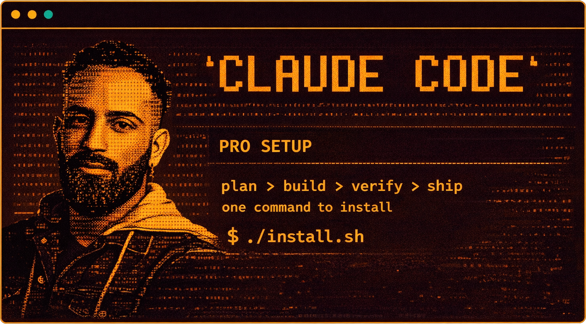

<p align="center">
  
</p>

# Claude Code Pro Setup

> One command to turn Claude Code into a production-grade AI engineering environment.

Custom agents, skills, MCP servers, auto-formatting hooks, and workflow automation — all preconfigured and ready to go.

---

## Recommended Workflow

This is how I use Claude Code to get the best results on any task:

```
Plan + Research  -->  Optimize Plan  -->  Execute in Phases  -->  Verify + Test  -->  Repeat
```

1. **Plan + Research** — Before touching code, have Claude research the problem and produce a written plan (`safe-planner` agent or `/plan`). Understand the blast radius.
2. **Optimize the plan** — Review the plan, ask questions, refine. Get alignment before execution.
3. **Execute in phases** — Break the work into small, shippable phases. Implement one phase at a time.
4. **Verify + test after each phase** — Run builds, tests, and visual checks (`live-test` agent) after every phase. Never stack unverified changes.
5. **Continue implementing** — Move to the next phase only after the current one passes.
6. **Run QA multiple times** — Use the `qa-agent` repeatedly until all bugs are fixed. Don't ship until it passes clean.

This loop ensures nothing slips through. Plan first, execute small, verify always.

---

## Quick Install

### Prerequisites

Make sure these are installed first:

| Tool              | Install Command                                          | Purpose                                           |
| ----------------- | -------------------------------------------------------- | ------------------------------------------------- |
| **Node.js + npm** | [nodejs.org](https://nodejs.org/) or `brew install node` | Required for MCP servers and npx                  |
| **Python 3**      | `brew install python3`                                   | Required for UI/UX Pro Max skill search engine    |
| **jq**            | `brew install jq`                                        | Required for hook JSON parsing                    |
| **Prettier**      | `npm install -g prettier`                                | Auto-formats TS/JS/CSS/JSON/MD/HTML on every edit |
| **Ruff**          | `pip install ruff`                                       | Auto-formats and lints Python on every edit       |
| **uv**            | `pip install uv`                                         | Required for Qdrant memory MCP server             |
| **Git**           | `brew install git`                                       | Required for cloning UI/UX Pro Max data           |

### Run the Installer

```bash
git clone https://github.com/zalogarcia/zalo-claude-code-setup.git
cd zalo-claude-code-setup
./install.sh
```

The installer will:

1. **Back up** all your existing Claude Code configs to `~/.claude/backups/`
2. **Copy** agents to `~/.claude/agents/`
3. **Copy** skills to `~/.claude/skills/` (clones UI/UX Pro Max data from GitHub)
4. **Install** global `CLAUDE.md` to `~/.claude/`
5. **Merge** hooks into `~/.claude/settings.json` (preserves your existing hooks)
6. **Merge** MCP servers into `~/.claude.json` (skips servers you already have)
7. **Prompt for API keys** — enters them directly into MCP server configs where they're needed
8. **Create** `~/.claude/settings.local.json` with env var placeholders for Bash tools (if not exists)

Safe to run multiple times — it deduplicates and never overwrites your existing configs.

> **Important:** MCP servers need actual API key values directly in `~/.claude.json`. The `${VAR}` syntax does NOT work for MCP env vars — it only works for Bash tool sessions. The installer handles this for you by prompting during setup.

---

## API Keys: How to Get Them

The installer will prompt you for these during setup. Here's how to get each one:

### GitHub Personal Access Token (required for GitHub MCP)

1. Go to [github.com/settings/tokens](https://github.com/settings/tokens?type=beta)
2. Click **"Generate new token"** (Fine-grained token recommended)
3. Give it a name like `claude-code`
4. Set expiration (90 days recommended)
5. Under **Repository access**, select the repos you want Claude to access
6. Under **Permissions**, grant: `Contents` (read/write), `Pull requests` (read/write), `Issues` (read/write)
7. Click **Generate token** and copy it

### Supabase Access Token (required for Supabase MCP)

1. Go to [supabase.com/dashboard/account/tokens](https://supabase.com/dashboard/account/tokens)
2. Click **"Generate new token"**
3. Give it a name like `claude-code`
4. Copy the token (starts with `sbp_`)

### Cloudflare API Token (optional — for cf-crawl website scraping skill)

1. Go to [dash.cloudflare.com/profile/api-tokens](https://dash.cloudflare.com/profile/api-tokens)
2. Click **"Create Token"**
3. Use the **"Edit Cloudflare Workers"** template (or create custom with Browser Rendering permissions)
4. Copy the token
5. Find your Account ID in the Cloudflare dashboard sidebar

### Where Keys End Up

| Key              | Location                                   | Used By                   |
| ---------------- | ------------------------------------------ | ------------------------- |
| GitHub PAT       | `~/.claude.json` > mcpServers.github.env   | GitHub MCP server         |
| Supabase token   | `~/.claude.json` > mcpServers.supabase.env | Supabase MCP server       |
| Cloudflare token | `~/.claude/settings.local.json` > env      | cf-crawl skill (via Bash) |

`~/.claude.json` is local-only and never committed to git. `settings.local.json` is `chmod 600` (owner-only).

### Restart Claude Code

Close and reopen Claude Code to pick up all changes.

---

## What's Included

### Custom Agents (4)

| Agent                   | What It Does                                                                                                             |
| ----------------------- | ------------------------------------------------------------------------------------------------------------------------ |
| **qa-agent**            | Audits code for real, reproducible bugs. Categorizes by severity (critical/high/medium/low). Run it after every feature. |
| **safe-planner**        | Reads all related code, maps dependencies and risks, produces a rollback-ready plan. Use before any non-trivial change.  |
| **live-test**           | Opens the app in a real browser via Playwright. Screenshots happy path, edge cases, and 3 responsive breakpoints.        |
| **frontend-specialist** | Builds production-quality UI — accessible, responsive, performant. Matches your existing codebase conventions.           |

### Skills (3)

| Skill               | What It Does                                                                                                                                |
| ------------------- | ------------------------------------------------------------------------------------------------------------------------------------------- |
| **ui-ux-pro-max**   | Searchable design database: 50 UI styles, 21 color palettes, 50 font pairings, 20 chart types, 8 tech stacks. Invoke with `/ui-ux-pro-max`. |
| **frontend-design** | Anti-slop aesthetic guidelines. Bold design direction, distinctive typography, no generic AI look. Invoke with `/frontend-design`.          |
| **cf-crawl**        | Scrape websites via Cloudflare Browser Rendering API. Single page (sync) or multi-page crawl (async). Invoke with `/cf-crawl`.              |

### MCP Servers (6)

| Server              | What It Does                                                                                                    |
| ------------------- | --------------------------------------------------------------------------------------------------------------- |
| **context7**        | Documentation lookup for any library or framework (React, Next.js, Supabase, etc.). Always up-to-date.          |
| **playwright**      | Browser automation — navigate, click, fill forms, screenshot. Powers the `live-test` agent.                     |
| **github**          | Full GitHub API — create PRs, manage issues, search code, push files. Requires `GITHUB_PAT`.                    |
| **supabase**        | Manage Supabase projects — run SQL, deploy edge functions, manage migrations. Requires `SUPABASE_ACCESS_TOKEN`. |
| **qdrant-memory**   | Local semantic search memory. Stores patterns, solutions, and decisions across conversations.                   |
| **knowledge-graph** | Local structured memory. Stores entity relationships, configs, and facts across conversations.                  |

### Auto-Formatting Hooks

Every time Claude edits a file, it's automatically formatted before you see it:

| File Types                                             | Formatter                    | Install                   |
| ------------------------------------------------------ | ---------------------------- | ------------------------- |
| `.ts` `.tsx` `.js` `.jsx` `.css` `.json` `.md` `.html` | **Prettier**                 | `npm install -g prettier` |
| `.py`                                                  | **Ruff** (format + lint fix) | `pip install ruff`        |

### Global CLAUDE.md

Behavioral rules that make Claude Code significantly more effective:

- **Self-learning** — When you correct Claude, it saves the lesson to prevent repeating mistakes
- **Project init** — Auto-scaffolds `.claude/CLAUDE.md` and `.claude/rules/` for new projects
- **Frontend auto-chain** — Building UI automatically triggers: design search -> aesthetic guidelines -> specialist agent -> visual verification
- **Verification-first** — Claude proves changes work (build, test, screenshot) instead of saying "this should work"
- **Context survival** — Plans are written to files so they survive compaction and session transfers
- **Subagent orchestration** — Complex work is delegated to specialized agents, keeping the main context clean

---

## Automated Frontend Workflow

When you ask Claude to build any UI (page, component, dashboard, landing page), it automatically chains these steps without you asking:

1. **`/ui-ux-pro-max`** — Searches the design database for the right palette, fonts, and style
2. **`/frontend-design`** — Applies anti-slop aesthetic principles (no generic Inter + purple gradient)
3. **`frontend-specialist` agent** — Builds production-quality code (a11y, responsiveness, edge states)
4. **`live-test` agent** — Opens a browser and screenshots the result for visual verification

No manual invocation needed. Just say "build me a pricing page" and the pipeline runs.

---

## Default Tech Stack

When you don't specify, Claude defaults to:

| Layer               | Default                                       |
| ------------------- | --------------------------------------------- |
| **Frontend**        | React + TypeScript + Tailwind CSS             |
| **Backend**         | Supabase (Edge Functions, Auth, RLS, Storage) |
| **Payments**        | Stripe                                        |
| **Deployment**      | Vercel or Supabase hosting                    |
| **Package manager** | npm                                           |
| **Testing**         | Vitest for unit, Playwright for e2e           |

---

## Dependencies Summary

Everything you need to install for the full setup to work:

```bash
# System tools (macOS)
brew install node python3 jq git

# Global npm packages
npm install -g prettier

# Python packages
pip install ruff uv
```

| Dependency    | Required By                                                 | Required?   |
| ------------- | ----------------------------------------------------------- | ----------- |
| Node.js + npm | MCP servers (github, supabase, playwright, knowledge-graph) | Yes         |
| Python 3      | UI/UX Pro Max search, installer scripts                     | Yes         |
| jq            | Hook JSON parsing                                           | Yes         |
| Git           | Installer (clones UI/UX Pro Max data)                       | Yes         |
| Prettier      | Auto-format hook (TS/JS/CSS/JSON/MD/HTML)                   | Recommended |
| Ruff          | Auto-format hook (Python)                                   | Recommended |
| uv/uvx        | Qdrant memory MCP server                                    | Recommended |

If a recommended tool is missing, the relevant hook or MCP will silently skip — nothing breaks.

---

## File Structure

```
.
├── README.md
├── install.sh                  # One-command installer (backs up first)
├── uninstall.sh                # Restore from backup
├── claude-md/
│   └── CLAUDE.md               # Global behavioral instructions
├── agents/
│   ├── qa-agent.md             # Bug auditor
│   ├── safe-planner.md         # Risk-aware planner
│   ├── live-test.md            # Browser verification
│   └── frontend-specialist.md  # UI builder
├── skills/
│   ├── ui-ux-pro-max/
│   │   └── SKILL.md            # Design database (scripts cloned at install)
│   ├── frontend-design/
│   │   └── SKILL.md            # Anti-slop aesthetics
│   └── cf-crawl/
│       └── SKILL.md            # Cloudflare web scraper
├── hooks/
│   └── settings.json           # Prettier + Ruff auto-formatting
└── mcp/
    ├── mcp-servers.json        # 6 MCP server configs
    └── env-template.json       # API key placeholders
```

---

## Uninstall

Restores everything from the backup created during install:

```bash
./uninstall.sh
```

Handles both scenarios:

- **Had existing configs** — Restores them from backup
- **Fresh install** — Cleanly removes everything that was added

---

## License

MIT
